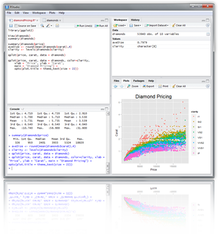
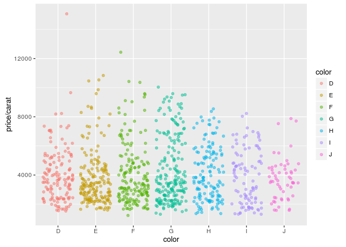
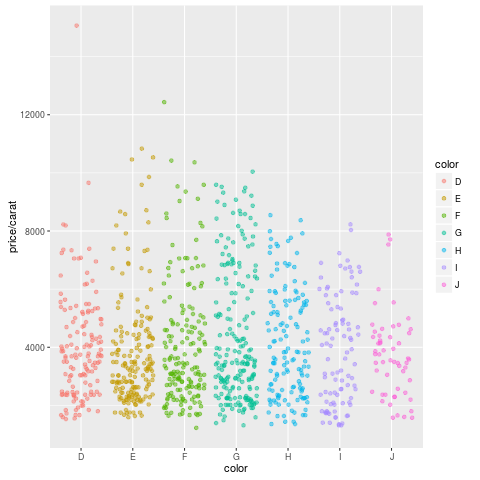

<!--
%% \VignetteEngine{knitr::rmarkdown}
%\VignetteIndexEntry{Overview Vignette}
%% \VignetteDepends{methods}
%% \VignetteKeywords{compute cluster, pipeline, reports}
%% \VignettePackage{longevityTools}
-->

<!---
- Compile from command-line
Rscript -e "rmarkdown::render('Rbasics.Rmd', clean=F)"; R CMD Stangle Rbasics.Rmd; Rscript ../md2jekyll.R Rbasics.knit.md 3

- Commit to github
git commit -am "some edits"; git push -u origin master

- To customize font size and other style features, add this line to output section in preamble:  
    css: style.css
-->

<script type="text/javascript">
document.addEventListener("DOMContentLoaded", function() {
  document.querySelector("h1").className = "title";
});
</script>
<script type="text/javascript">
document.addEventListener("DOMContentLoaded", function() {
  var links = document.links;  
  for (var i = 0, linksLength = links.length; i < linksLength; i++)
    if (links[i].hostname != window.location.hostname)
      links[i].target = '_blank';
});
</script>


# Overview

## What is R?

[R](http://cran.at.r-project.org) is a powerful statistical environment and
programming language for the analysis and visualization of data.  The
associated [Bioconductor](http://bioconductor.org/) and CRAN package
repositories provide many additional R packages for statistical data analysis
for a wide array of research areas. The R software is free and runs on all
common operating systems. 

## Why Using R?
* Complete statistical environment and programming language
* Efficient functions and data structures for data analysis
* Powerful graphics
* Access to fast growing number of analysis packages
* Most widely used language in bioinformatics
* Is standard for data mining and biostatistical analysis
* Technical advantages: free, open-source, available for all OSs

## Books and Documentation
* simpleR - Using R for Introductory Statistics (John Verzani, 2004) - [URL](http://cran.r-project.org/doc/contrib/Verzani-SimpleR.pdf)
* Bioinformatics and Computational Biology Solutions Using R and Bioconductor (Gentleman et al., 2005) - [URL](http://www.bioconductor.org/help/publications/books/bioinformatics-and-computational-biology-solutions/)
* More on this see "Finding Help" section in UCR Manual - [URL](http://manuals.bioinformatics.ucr.edu/home/R\_BioCondManual\#TOC-Finding-Help)

## R Working Environments

## Working environments (IDEs) for R
<center></center>
<center> R Projects and Interfaces</center>

Some R working environments with support for syntax highlighting and utilities to send code 
to the R console: 

* [RStudio](https://www.rstudio.com/products/rstudio/features): excellent choice for beginners ([Cheat Sheet](http://www.rstudio.com/wp-content/uploads/2016/01/rstudio-IDE-cheatsheet.pdf)) 
* Basic R code editors provided by Rguis 
* [gedit](https://wiki.gnome.org/Apps/Gedit), [Rgedit](http://rgedit.sourceforge.net/), [RKWard](https://rkward.kde.org/), [Eclipse](http://www.walware.de/goto/statet), [Tinn-R](http://www.sciviews.org/Tinn-R/), [Notepad++](https://notepad-plus-plus.org/), [NppToR](http://sourceforge.net/projects/npptor/)
* [Vim-R-Tmux](http://manuals.bioinformatics.ucr.edu/home/programming-in-r/vim-r): R working environment based on vim and tmux 
* [Emacs](http://www.xemacs.org/Download/index.html) ([ESS add-on package](http://ess.r-project.org/))
	
### Example: RStudio 

New integrated development environment (IDE) for [R](http://www.rstudio.com/ide/download/). Highly functional for both beginners and 
advanced.

<center></center>
<center> RStudio IDE</center>

Some userful shortcuts: `Ctrl+Enter` (send code), `Ctrl+Shift+C` (comment/uncomment), `Ctrl+1/2` (switch window focus)

### Example: Vim-R-Tmux

Terminal-based Working Environment for R: [Vim-R-Tmux](http://manuals.bioinformatics.ucr.edu/home/programming-in-r/vim-r)

<center></center>
<center>Vim-R-Tmux IDE for R</center>

# R Package Repositories

* CRAN (>8,000 packages) general data analysis - [URL](http://cran.at.r-project.org/)
* Bioconductor (>1,100 packages) bioscience data analysis - [URL](http://www.bioconductor.org/)
* Omegahat (>90 packages) programming interfaces - [URL](https://github.com/omegahat?tab=repositories)

# Installation of R and Add-on Packages

(1.) Install R for your operating system from [CRAN](http://cran.at.r-project.org/).

(2.) Install RStudio from [RStudio](http://www.rstudio.com/ide/download).

(3.) Install CRAN Packages from R console like this:


```r
install.packages(c("pkg1", "pkg2")) 
install.packages("pkg.zip", repos=NULL)
```

(4.) Install Bioconductor packages as follows:


```r
source("http://www.bioconductor.org/biocLite.R")
library(BiocInstaller)
BiocVersion()
biocLite()
biocLite(c("pkg1", "pkg2"))
```

(5.) For more details consult the [Bioc Install page](http://www.bioconductor.org/install/)
and [BiocInstaller](http://www.bioconductor.org/packages/release/bioc/html/BiocInstaller.html) package.

# Getting Around

## Startup and Closing Behavior

* __Starting R__:
    The R GUI versions, including RStudio, under Windows and Mac OS X can be
    opened by double-clicking their icons. Alternatively, one can start it by
    typing `R` in a terminal (default under Linux). 

* __Startup/Closing Behavior__:
    The R environment is controlled by hidden files in the startup directory:
    `.RData`, `.Rhistory` and `.Rprofile` (optional). 
	
    
* __Closing R__:


```r
q()  
```
```
Save workspace image? [y/n/c]:
```
        
* __Note__:
    When responding with `y`, then the entire R workspace will be written to
    the `.RData` file which can become very large. Often it is sufficient to just
    save an analysis protocol in an R source file. This way one can quickly
    regenerate all data sets and objects. 


## Navigating directories

Create an object with the assignment operator `<-` or `=`

```r
object <- ...
```

List objects in current R session

```r
ls()
```

Return content of current working directory

```r
dir()
```

Return path of current working directory

```r
getwd()
```

Change current working directory

```r
setwd("/home/user")
```

# Basic Syntax

General R command syntax


```r
object <- function_name(arguments) 
object <- object[arguments] 
```

Finding help


```r
?function_name
```

Load a library/package


```r
library("my_library") 
```

List functions defined by a library


```r
library(help="my_library")
```

Load library manual (PDF or HTML file)


```r
vignette("my_library") 
```

Execute an R script from within R


```r
source("my_script.R")
```

Execute an R script from command-line (the first of the three options is preferred)


```sh
$ Rscript my_script.R
$ R CMD BATCH my_script.R 
$ R --slave < my_script.R 
```

# Data Types 

## Numeric data

Example: `1, 2, 3, ...`


```r
x <- c(1, 2, 3)
x
```

```
## [1] 1 2 3
```

```r
is.numeric(x)
```

```
## [1] TRUE
```

```r
as.character(x)
```

```
## [1] "1" "2" "3"
```

## Character data

Example: `"a", "b", "c", ...`


```r
x <- c("1", "2", "3")
x
```

```
## [1] "1" "2" "3"
```

```r
is.character(x)
```

```
## [1] TRUE
```

```r
as.numeric(x)
```

```
## [1] 1 2 3
```

## Complex data

Example: mix of both


```r
c(1, "b", 3)
```

```
## [1] "1" "b" "3"
```

## Logical data

Example: `TRUE` of `FALSE`


```r
x <- 1:10 < 5
x  
```

```
##  [1]  TRUE  TRUE  TRUE  TRUE FALSE FALSE FALSE FALSE FALSE FALSE
```

```r
!x
```

```
##  [1] FALSE FALSE FALSE FALSE  TRUE  TRUE  TRUE  TRUE  TRUE  TRUE
```

```r
which(x) # Returns index for the 'TRUE' values in logical vector
```

```
## [1] 1 2 3 4
```

# Data objects

## Object types

## Vectors (1D)

Definition: `numeric` or `character`


```r
myVec <- 1:10; names(myVec) <- letters[1:10]  
myVec[1:5]
```

```
## a b c d e 
## 1 2 3 4 5
```

```r
myVec[c(2,4,6,8)]
```

```
## b d f h 
## 2 4 6 8
```

```r
myVec[c("b", "d", "f")]
```

```
## b d f 
## 2 4 6
```

## Factors (1D)

Definition: vectors with grouping information


```r
factor(c("dog", "cat", "mouse", "dog", "dog", "cat"))
```

```
## [1] dog   cat   mouse dog   dog   cat  
## Levels: cat dog mouse
```

## Matrices (2D)

Definition: two dimensional structures with data of same type


```r
myMA <- matrix(1:30, 3, 10, byrow = TRUE) 
class(myMA)
```

```
## [1] "matrix"
```

```r
myMA[1:2,]
```

```
##      [,1] [,2] [,3] [,4] [,5] [,6] [,7] [,8] [,9] [,10]
## [1,]    1    2    3    4    5    6    7    8    9    10
## [2,]   11   12   13   14   15   16   17   18   19    20
```

```r
myMA[1, , drop=FALSE]
```

```
##      [,1] [,2] [,3] [,4] [,5] [,6] [,7] [,8] [,9] [,10]
## [1,]    1    2    3    4    5    6    7    8    9    10
```

## Data Frames (2D)

Definition: two dimensional objects with data of variable types


```r
myDF <- data.frame(Col1=1:10, Col2=10:1) 
myDF[1:2, ]
```

```
##   Col1 Col2
## 1    1   10
## 2    2    9
```

## Arrays

Definition: data structure with one, two or more dimensions


## Lists

Definition: containers for any object type


```r
myL <- list(name="Fred", wife="Mary", no.children=3, child.ages=c(4,7,9)) 
myL
```

```
## $name
## [1] "Fred"
## 
## $wife
## [1] "Mary"
## 
## $no.children
## [1] 3
## 
## $child.ages
## [1] 4 7 9
```

```r
myL[[4]][1:2] 
```

```
## [1] 4 7
```

## Functions

Definition: piece of code


```r
myfct <- function(arg1, arg2, ...) { 
	function_body 
}
```

## Subsetting of data objects

__(1.) Subsetting by positive or negative index/position numbers__


```r
myVec <- 1:26; names(myVec) <- LETTERS 
myVec[1:4]
```

```
## A B C D 
## 1 2 3 4
```

__(2.) Subsetting by same length logical vectors__


```r
myLog <- myVec > 10
myVec[myLog] 
```

```
##  K  L  M  N  O  P  Q  R  S  T  U  V  W  X  Y  Z 
## 11 12 13 14 15 16 17 18 19 20 21 22 23 24 25 26
```

__(3.) Subsetting by field names__


```r
myVec[c("B", "K", "M")]
```

```
##  B  K  M 
##  2 11 13
```

__(4.) Subset with `$` sign__: references a single column or list component by its name 


```r
iris$Species[1:8]
```

```
## [1] setosa setosa setosa setosa setosa setosa setosa setosa
## Levels: setosa versicolor virginica
```

# Important Utilities
	
## Combining Objects

The `c` function combines vectors and lists


```r
c(1, 2, 3)
```

```
## [1] 1 2 3
```

```r
x <- 1:3; y <- 101:103
c(x, y)
```

```
## [1]   1   2   3 101 102 103
```

```r
iris$Species[1:8]
```

```
## [1] setosa setosa setosa setosa setosa setosa setosa setosa
## Levels: setosa versicolor virginica
```

The `cbind` and `rbind` functions can be used to append columns and rows, respecively.

```r
ma <- cbind(x, y)
ma
```

```
##      x   y
## [1,] 1 101
## [2,] 2 102
## [3,] 3 103
```

```r
rbind(ma, ma)
```

```
##      x   y
## [1,] 1 101
## [2,] 2 102
## [3,] 3 103
## [4,] 1 101
## [5,] 2 102
## [6,] 3 103
```

## Accessing Dimensions of Objects

Length and dimension information of objects


```r
length(iris$Species)
```

```
## [1] 150
```

```r
dim(iris)
```

```
## [1] 150   5
```

## Accessing Name Slots of Objects

Accessing row and column names of 2D objects

```r
rownames(iris)[1:8]
```

```
## [1] "1" "2" "3" "4" "5" "6" "7" "8"
```

```r
colnames(iris)
```

```
## [1] "Sepal.Length" "Sepal.Width"  "Petal.Length" "Petal.Width"  "Species"
```

Return name field of vectors and lists

```r
names(myVec)
```

```
##  [1] "A" "B" "C" "D" "E" "F" "G" "H" "I" "J" "K" "L" "M" "N" "O" "P" "Q" "R" "S" "T" "U" "V" "W" "X"
## [25] "Y" "Z"
```

```r
names(myL)
```

```
## [1] "name"        "wife"        "no.children" "child.ages"
```

## Sorting Objects

The function `sort` returns a vector in ascending or descending order

```r
sort(10:1)
```

```
##  [1]  1  2  3  4  5  6  7  8  9 10
```

The function `order` returns a sorting index for sorting an object

```r
sortindex <- order(iris[,1], decreasing = FALSE)
sortindex[1:12]
```

```
##  [1] 14  9 39 43 42  4  7 23 48  3 30 12
```

```r
iris[sortindex,][1:2,]
```

```
##    Sepal.Length Sepal.Width Petal.Length Petal.Width Species
## 14          4.3         3.0          1.1         0.1  setosa
## 9           4.4         2.9          1.4         0.2  setosa
```

```r
sortindex <- order(-iris[,1]) # Same as decreasing=TRUE
```
Sorting multiple columns

```r
iris[order(iris$Sepal.Length, iris$Sepal.Width),][1:2,]
```

```
##    Sepal.Length Sepal.Width Petal.Length Petal.Width Species
## 14          4.3         3.0          1.1         0.1  setosa
## 9           4.4         2.9          1.4         0.2  setosa
```

# Operators and Calculations

## Comparison Operators

Comparison operators: `==`, `!=`, `<`, `>`, `<=`, `>=`

```r
1==1
```

```
## [1] TRUE
```
Logical operators: AND: `&`, OR: `|`, NOT: `!`

```r
x <- 1:10; y <- 10:1
x > y & x > 5
```

```
##  [1] FALSE FALSE FALSE FALSE FALSE  TRUE  TRUE  TRUE  TRUE  TRUE
```

## Basic Calculations

To look up math functions, see Function Index [here](http://cran.at.r-project.org/doc/manuals/R-intro.html#Function-and-variable-index)

```r
x + y
```

```
##  [1] 11 11 11 11 11 11 11 11 11 11
```

```r
sum(x)
```

```
## [1] 55
```

```r
mean(x)
```

```
## [1] 5.5
```

```r
apply(iris[1:6,1:3], 1, mean) 
```

```
##        1        2        3        4        5        6 
## 3.333333 3.100000 3.066667 3.066667 3.333333 3.666667
```

# Reading and Writing External Data
## Import of tabular data

Import of a tab-delimited tabular file

```r
myDF <- read.delim("myData.xls", sep="\t")
```

Import of Excel file. Note: working with tab- or comma-delimited files is more flexible and preferred.

```r
library(gdata)
myDF <- read.xls"myData.xls")
```

Import of Google Sheets. The following example imports a sample Google Sheet from [here](https://docs.google.com/spreadsheets/d/1U-32UcwZP1k3saKeaH1mbvEAOfZRdNHNkWK2GI1rpPM/edit#gid=472150521).
Detailed instructions for interacting from R with Google Sheets with the required `googlesheets` package are [here](https://github.com/jennybc/googlesheets).


```r
library("googlesheets"); library("dplyr"); library(knitr)
gs_auth() # Creates authorizaton token (.httr-oauth) in current directory if not present
sheetid <-"1U-32UcwZP1k3saKeaH1mbvEAOfZRdNHNkWK2GI1rpPM"
gap <- gs_key(sheetid)
mysheet <- gs_read(gap, skip=4)
myDF <- as.data.frame(mysheet)
myDF
```

## Export of tabular data

```r
write.table(myDF, file="myfile.xls", sep="\t", quote=FALSE, col.names=NA)
```

## Line-wise import

```r
myDF <- readLines("myData.txt")
```

## Line-wise export

```r
writeLines(month.name, "myData.txt")
```

## Copy and paste into R

On Windows/Linux systems

```r
read.delim("clipboard") 
```
On Mac OS X systems

```r
read.delim(pipe("pbpaste")) 
```

## Copy and paste from R 

On Windows/Linux systems

```r
write.table(iris, "clipboard", sep="\t", col.names=NA, quote=F) 
```

On Mac OS X systems

```r
zz <- pipe('pbcopy', 'w')
write.table(iris, zz, sep="\t", col.names=NA, quote=F)
close(zz) 
```

## Homework 3A 

Homework 3A: [Object Subsetting Routines and Import/Export](http://girke.bioinformatics.ucr.edu/GEN242/mydoc/mydoc_homework_03.html)

# Useful R Functions

## Unique entries

Make vector entries unique with `unique`


```r
length(iris$Sepal.Length)
```

```
## [1] 150
```

```r
length(unique(iris$Sepal.Length))
```

```
## [1] 35
```

## Count occurrences

Count occurrences of entries with `table`

```r
table(iris$Species)
```

```
## 
##     setosa versicolor  virginica 
##         50         50         50
```

## Aggregate data

Compute aggregate statistics with `aggregate`

```r
aggregate(iris[,1:4], by=list(iris$Species), FUN=mean, na.rm=TRUE)
```

```
##      Group.1 Sepal.Length Sepal.Width Petal.Length Petal.Width
## 1     setosa        5.006       3.428        1.462       0.246
## 2 versicolor        5.936       2.770        4.260       1.326
## 3  virginica        6.588       2.974        5.552       2.026
```

## Intersect data

Compute intersect between two vectors with `%in%`

```r
month.name %in% c("May", "July")
```

```
##  [1] FALSE FALSE FALSE FALSE  TRUE FALSE  TRUE FALSE FALSE FALSE FALSE FALSE
```

## Merge data frames

Join two data frames by common field entries with `merge` (here row names `by.x=0`). To obtain only the common rows, change `all=TRUE` to `all=FALSE`. To merge on specific columns, refer to them by their position numbers or their column names.

```r
frame1 <- iris[sample(1:length(iris[,1]), 30), ]
frame1[1:2,]
```

```
##    Sepal.Length Sepal.Width Petal.Length Petal.Width Species
## 18          5.1         3.5          1.4         0.3  setosa
## 41          5.0         3.5          1.3         0.3  setosa
```

```r
dim(frame1)
```

```
## [1] 30  5
```

```r
my_result <- merge(frame1, iris, by.x = 0, by.y = 0, all = TRUE)
dim(my_result)
```

```
## [1] 150  11
```

# SQLite Databases

`SQLite` is a lightweight relational database solution. The `RSQLite` package provides an easy to use interface to create, manage and query `SQLite` databases directly from R. Basic instructions
for using `SQLite` from the command-line are available [here](https://www.sqlite.org/cli.html). A short introduction to `RSQLite` is available [here](https://github.com/rstats-db/RSQLite/blob/master/vignettes/RSQLite.Rmd).

## Loading data into SQLite databases

The following loads two `data.frames` derived from the `iris` data set (here `mydf1` and `mydf2`) 
into an SQLite database (here `test.db`).


```r
library(RSQLite)
```

```
## Loading required package: DBI
```

```
## Loading required package: methods
```

```r
mydb <- dbConnect(SQLite(), "test.db") # Creates database file test.db
mydf1 <- data.frame(ids=paste0("id", seq_along(iris[,1])), iris)
mydf2 <- mydf1[sample(seq_along(mydf1[,1]), 10),]
dbWriteTable(mydb, "mydf1", mydf1)
```

```
## [1] TRUE
```

```r
dbWriteTable(mydb, "mydf2", mydf2)
```

```
## [1] TRUE
```

## List names of tables in database


```r
dbListTables(mydb)
```

```
## [1] "mydf1" "mydf2"
```

## Import table into `data.frame`


```r
dbGetQuery(mydb, 'SELECT * FROM mydf2')
```

```
##      ids Sepal.Length Sepal.Width Petal.Length Petal.Width    Species
## 1   id53          6.9         3.1          4.9         1.5 versicolor
## 2  id145          6.7         3.3          5.7         2.5  virginica
## 3   id70          5.6         2.5          3.9         1.1 versicolor
## 4  id108          7.3         2.9          6.3         1.8  virginica
## 5    id6          5.4         3.9          1.7         0.4     setosa
## 6   id87          6.7         3.1          4.7         1.5 versicolor
## 7  id139          6.0         3.0          4.8         1.8  virginica
## 8   id31          4.8         3.1          1.6         0.2     setosa
## 9  id143          5.8         2.7          5.1         1.9  virginica
## 10  id29          5.2         3.4          1.4         0.2     setosa
```

## Query database


```r
dbGetQuery(mydb, 'SELECT * FROM mydf1 WHERE "Sepal.Length" < 4.6')
```

```
##    ids Sepal.Length Sepal.Width Petal.Length Petal.Width Species
## 1  id9          4.4         2.9          1.4         0.2  setosa
## 2 id14          4.3         3.0          1.1         0.1  setosa
## 3 id39          4.4         3.0          1.3         0.2  setosa
## 4 id42          4.5         2.3          1.3         0.3  setosa
## 5 id43          4.4         3.2          1.3         0.2  setosa
```

## Join tables

The two tables can be joined on the shared `ids` column as follows. 


```r
dbGetQuery(mydb, 'SELECT * FROM mydf1, mydf2 WHERE mydf1.ids = mydf2.ids')
```

```
##      ids Sepal.Length Sepal.Width Petal.Length Petal.Width    Species   ids Sepal.Length
## 1    id6          5.4         3.9          1.7         0.4     setosa   id6          5.4
## 2   id29          5.2         3.4          1.4         0.2     setosa  id29          5.2
## 3   id31          4.8         3.1          1.6         0.2     setosa  id31          4.8
## 4   id53          6.9         3.1          4.9         1.5 versicolor  id53          6.9
## 5   id70          5.6         2.5          3.9         1.1 versicolor  id70          5.6
## 6   id87          6.7         3.1          4.7         1.5 versicolor  id87          6.7
## 7  id108          7.3         2.9          6.3         1.8  virginica id108          7.3
## 8  id139          6.0         3.0          4.8         1.8  virginica id139          6.0
## 9  id143          5.8         2.7          5.1         1.9  virginica id143          5.8
## 10 id145          6.7         3.3          5.7         2.5  virginica id145          6.7
##    Sepal.Width Petal.Length Petal.Width    Species
## 1          3.9          1.7         0.4     setosa
## 2          3.4          1.4         0.2     setosa
## 3          3.1          1.6         0.2     setosa
## 4          3.1          4.9         1.5 versicolor
## 5          2.5          3.9         1.1 versicolor
## 6          3.1          4.7         1.5 versicolor
## 7          2.9          6.3         1.8  virginica
## 8          3.0          4.8         1.8  virginica
## 9          2.7          5.1         1.9  virginica
## 10         3.3          5.7         2.5  virginica
```

# R Markdown

## Overview

R Markdown combines markdown (an easy to write plain text format) with embedded
R code chunks. When compiling R Markdown documents, the code components can be
evaluated so that both the code and its output can be included in the final
document. This makes analysis reports highly reproducible by allowing to automatically
regenerate them when the underlying R code or data changes. R Markdown
documents (`.Rmd` files) can be rendered to various formats including HTML and
PDF. The R code in an `.Rmd` document is processed by `knitr`, while the
resulting `.md` file is rendered by `pandoc` to the final output formats
(_e.g._ HTML or PDF). Historically, R Markdown is an extension of the older
`Sweave/Latex` environment. Rendering of mathematical expressions and reference
management is also supported by R Markdown using embedded Latex syntax and
Bibtex, respectively.

## Quick Start

### Install R Markdown


```r
install.packages("rmarkdown")
```

### Initialize a new R Markdown (`Rmd`) script

To minimize typing, it can be helful to start with an R Markdown template and
then modify it as needed. Note the file name of an R Markdown scirpt needs to
have the extension `.Rmd`. Template files for the following examples are available 
here:

+ R Markdown sample script: [`sample.Rmd`](https://raw.githubusercontent.com/tgirke/GEN242/master/vignettes/07_Rbasics/sample.Rmd)
+ Bibtex file for handling citations and reference section: [`bibtex.bib`](https://raw.githubusercontent.com/tgirke/GEN242/master/vignettes/07_Rbasics/bibtex.bib)

Users want to download these files, open the `sample.Rmd` file with their preferred R IDE 
(_e.g._ RStudio, vim or emacs), initilize an R session and then direct their R session to 
the location of these two files.


### Metadata section

The metadata section (YAML header) in an R Markdown script defines how it will be processed and 
rendered. The metadata section also includes both title, author, and date information as well as 
options for customizing the output format. For instance, PDF and HTML output can be defined 
with `pdf_document` and `html_document`, respectively. The `BiocStyle::` prefix will use the
formatting style of the [`BiocStyle`](http://bioconductor.org/packages/release/bioc/html/BiocStyle.html) 
package from Bioconductor.

```
 ---
title: "My First R Markdown Document"
author: "Author: First Last"
date: "Last update: 04 July, 2016"
output:
  BiocStyle::html_document:
    toc: true
    toc_depth: 3
    fig_caption: yes

fontsize: 14pt
bibliography: bibtex.bib
 ---
```

### Render `Rmd` script

An R Markdown script can be evaluated and rendered with the following `render` command or by pressing the `knit` button in RStudio.
The `output_format` argument defines the format of the output (_e.g._ `html_document`). The setting `output_format="all"` will generate 
all supported output formats. Alternatively, one can specify several output formats in the metadata section as shown in the above example.


```r
rmarkdown::render("sample.Rmd", clean=TRUE, output_format="html_document")
```

The following shows two options how to run the rendering from the command-line.


```sh
$ echo "rmarkdown::render('sample.Rmd', clean=TRUE)" | R --slave
$ Rscript -e "rmarkdown::render('sample.Rmd', clean=TRUE)"
```

Alternatively, one can use a Makefile to evaluate and render an R Markdown
script. A sample Makefile for rendering the above `sample.Rmd` can be
downloaded [`here`](https://raw.githubusercontent.com/tgirke/GEN242/master/vignettes/07_Rbasics/Makefile).
To apply it to a custom `Rmd` file, one needs open the Makefile in a text
editor and change the value assigned to `MAIN` (line 13) to the base name of
the corresponding `.Rmd` file (_e.g._ assign `systemPipeRNAseq` if the file
name is `systemPipeRNAseq.Rmd`).  To execute the `Makefile`, run the following
command from the command-line.


```sh
$ make -B
```

### R code chunks

R Code Chunks can be embedded in an R Markdown script by using three backticks
at the beginning of a new line along with arguments enclosed in curly braces
controlling the behavior of the code. The following lines contain the
plain R code. A code chunk is terminated by a new line starting with three backticks.
The following shows an example of such a code chunk. Note the backslashes are
not part of it. They have been added to print the code chunk syntax in this document.

```
	```\{r code_chunk_name, eval=FALSE\}
	x <- 1:10
	```
```

The following lists the most important arguments to control the behavior of R code chunks:

+ `r`: specifies language for code chunk, here R
+ `chode_chunk_name`: name of code chunk; this name needs to be unique
+ `eval`: if assigned `TRUE` the code will be evaluated
+ `warning`: if assigned `FALSE` warnings will not be shown
+ `message`: if assigned `FALSE` messages will not be shown
+ `cache`: if assigned `TRUE` results will be cached to reuse in future rendering instances
+ `fig.height`: allows to specify height of figures in inches
+ `fig.width`: allows to specify width of figures in inches

For more details on code chunk options see [here](https://www.rstudio.com/wp-content/uploads/2015/03/rmarkdown-reference.pdf).


### Learning Markdown

The basic syntax of Markdown and derivatives like kramdown is extremely easy to learn. Rather
than providing another introduction on this topic, here are some useful sites for learning Markdown:

+ [Markdown Intro on GitHub](https://guides.github.com/features/mastering-markdown/)
+ [Markdown Cheet Sheet](https://github.com/adam-p/markdown-here/wiki/Markdown-Cheatsheet)
+ [Markdown Basics from RStudio](http://rmarkdown.rstudio.com/authoring_basics.html) 
+ [R Markdown Cheat Sheet](http://www.rstudio.com/wp-content/uploads/2015/02/rmarkdown-cheatsheet.pdf)
+ [kramdown Syntax](http://kramdown.gettalong.org/syntax.html)

### Tables

There are several ways to render tables. First, they can be printed within the R code chunks. Second, 
much nicer formatted tables can be generated with the functions `kable`, `pander` or `xtable`. The following
example uses `kable` from the `knitr` package.


```r
library(knitr)
kable(iris[1:12,])
```


 Sepal.Length   Sepal.Width   Petal.Length   Petal.Width  Species 
-------------  ------------  -------------  ------------  --------
          5.1           3.5            1.4           0.2  setosa  
          4.9           3.0            1.4           0.2  setosa  
          4.7           3.2            1.3           0.2  setosa  
          4.6           3.1            1.5           0.2  setosa  
          5.0           3.6            1.4           0.2  setosa  
          5.4           3.9            1.7           0.4  setosa  
          4.6           3.4            1.4           0.3  setosa  
          5.0           3.4            1.5           0.2  setosa  
          4.4           2.9            1.4           0.2  setosa  
          4.9           3.1            1.5           0.1  setosa  
          5.4           3.7            1.5           0.2  setosa  
          4.8           3.4            1.6           0.2  setosa  

### Figures

Plots generated by the R code chunks in an R Markdown document can be automatically 
inserted in the output file. The size of the figure can be controlled with the `fig.height`
and `fig.width` arguments.


```r
library(ggplot2)
dsmall <- diamonds[sample(nrow(diamonds), 1000), ]
ggplot(dsmall, aes(color, price/carat)) + geom_jitter(alpha = I(1 / 2), aes(color=color))
```

<!-- -->

Sometimes it can be useful to explicitly write an image to a file and then insert that 
image into the final document by referencing its file name in the R Markdown source. For 
instance, this can be useful for time consuming analyses. The following code will generate a 
file named `myplot.png`. To insert the file  in the final document, one can use standard 
Markdown or HTML syntax, _e.g._: ``.  


```r
png("myplot.png")
ggplot(dsmall, aes(color, price/carat)) + geom_jitter(alpha = I(1 / 2), aes(color=color))
dev.off()
```

```
## png 
##   2
```
<center></center>

### Inline R code

To evaluate R code inline, one can enclose an R expression with a single back-tick
followed by `r` and then the actual expression.  For instance, the back-ticked version 
of 'r 1 + 1' evaluates to 2 and 'r pi' evaluates to 3.1415927.

### Mathematical equations

To render mathematical equations, one can use standard Latex syntax. When expressions are 
enclosed with single `$` signs then they will be shown inline, while 
enclosing them with double `$$` signs will show them in display mode. For instance, the following 
Latex syntax `d(X,Y) = \sqrt[]{ \sum_{i=1}^{n}{(x_{i}-y_{i})^2} }` renders in display mode as follows:

$$d(X,Y) = \sqrt[]{ \sum_{i=1}^{n}{(x_{i}-y_{i})^2} }$$

### Citations and bibliographies

Citations and bibliographies can be autogenerated in R Markdown in a similar
way as in Latex/Bibtex. Reference collections should be stored in a separate
file in Bibtex or other supported formats. To cite a publication in an R Markdown 
script, one uses the syntax `[@<id1>]` where `<id1>` needs to be replaced with a 
reference identifier present in the Bibtex database listed in the metadata section 
of the R Markdown script  (_e.g._ `bibtex.bib`). For instance, to cite Lawrence et al. 
(2013), one  uses its reference identifier (_e.g._ `Lawrence2013-kt`) as `<id1>` [@Lawrence2013-kt]. 
This will place the citation inline in the text and add the corresponding
reference to a reference list at the end of the output document. For the latter a 
special section called `References` needs to be specified at the end of the R Markdown script.
To fine control the formatting of citations and reference lists, users want to consult this 
the corresponding [R Markdown page](http://rmarkdown.rstudio.com/authoring_bibliographies_and_citations.html).
Also, for general reference management and outputting references in Bibtex format [Paperpile](https://paperpile.com/features) 
can be very helpful.

# Session Info


```r
sessionInfo()
```

```
## R version 3.3.1 (2016-06-21)
## Platform: x86_64-pc-linux-gnu (64-bit)
## Running under: Ubuntu 14.04.4 LTS
## 
## locale:
##  [1] LC_CTYPE=en_US.UTF-8       LC_NUMERIC=C               LC_TIME=en_US.UTF-8       
##  [4] LC_COLLATE=en_US.UTF-8     LC_MONETARY=en_US.UTF-8    LC_MESSAGES=en_US.UTF-8   
##  [7] LC_PAPER=en_US.UTF-8       LC_NAME=C                  LC_ADDRESS=C              
## [10] LC_TELEPHONE=C             LC_MEASUREMENT=en_US.UTF-8 LC_IDENTIFICATION=C       
## 
## attached base packages:
## [1] methods   stats     graphics  utils     datasets  grDevices base     
## 
## other attached packages:
## [1] knitr_1.13      gplots_3.0.1    RSQLite_1.0.0   DBI_0.4-1       ggplot2_2.1.0   limma_3.28.10  
## [7] BiocStyle_2.0.2
## 
## loaded via a namespace (and not attached):
##  [1] Rcpp_0.12.5        magrittr_1.5       munsell_0.4.3      colorspace_1.2-6   highr_0.6         
##  [6] stringr_1.0.0      plyr_1.8.4         caTools_1.17.1     tools_3.3.1        grid_3.3.1        
## [11] gtable_0.2.0       KernSmooth_2.23-15 htmltools_0.3.5    gtools_3.5.0       yaml_2.1.13       
## [16] digest_0.6.9       formatR_1.4        bitops_1.0-6       codetools_0.2-14   evaluate_0.9      
## [21] rmarkdown_0.9.6    labeling_0.3       gdata_2.17.0       stringi_1.1.1      scales_0.4.0
```

# References

