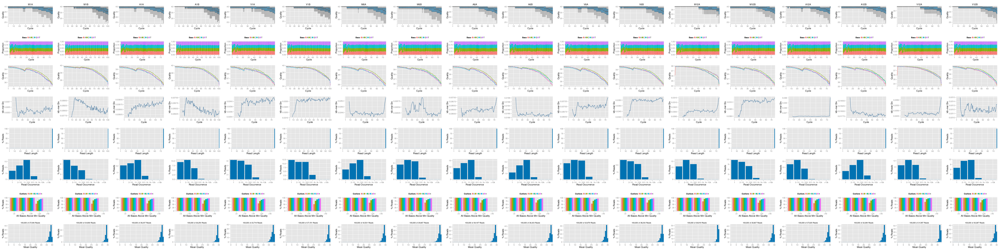
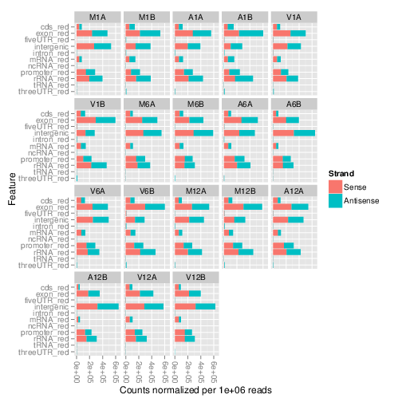
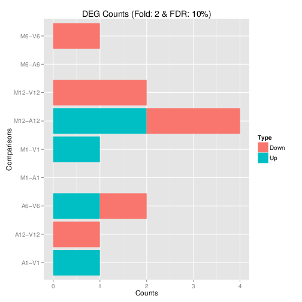
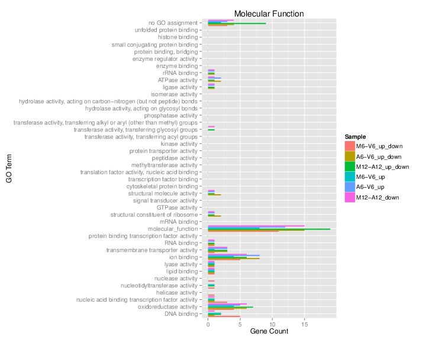
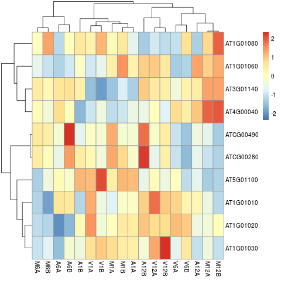

<!--
%% \VignetteEngine{knitr::rmarkdown}
%\VignetteIndexEntry{RNA-Seq Workflow Template}
%% \VignetteDepends{rjson, ggplot2, limma, edgeR, DESeq2, GOstats, GO.db, annotate, pheatmap}
%% \VignetteKeywords{compute cluster, pipeline, reports}
%% \VignettePackage{systemPipeR}
-->

<!---
- Conversion from Rnw/tex to Rmd
    - Build vignette from Rnw 
    - Then run: pandoc -s systemPipeRNAseq.tex -o systemPipeRNAseq.Rmd
    - The fix things, usually a lot...

- Compile from command-line
Rscript -e "rmarkdown::render('systemPipeRNAseq.Rmd', clean=F)"; R CMD Stangle systemPipeRNAseq.Rmd; Rscript ../md2jekyll.R systemPipeRNAseq.knit.md 6

- Commit to github
git commit -am "some edits"; git push -u origin master

- To customize font size and other style features, add this line to output section in preamble:  
    css: style.css
-->

<script type="text/javascript">
document.addEventListener("DOMContentLoaded", function() {
  document.querySelector("h1").className = "title";
});
</script>
<script type="text/javascript">
document.addEventListener("DOMContentLoaded", function() {
  var links = document.links;  
  for (var i = 0, linksLength = links.length; i < linksLength; i++)
    if (links[i].hostname != window.location.hostname)
      links[i].target = '_blank';
});
</script>

Note: the most recent version of this tutorial can be found <a href="https://htmlpreview.github.io/?https://github.com/tgirke/systemPipeR/blob/master/vignettes/systemPipeRNAseq.html">here</a> and a short overview slide show [here](https://htmlpreview.github.io/?https://github.com/tgirke/systemPipeR/master/inst/extdata/slides/systemPipeRslides.html).

# Introduction

Users want to provide here background information about the design of their RNA-Seq project.


# Sample definitions and environment settings

## Environment settings and input data

Typically, the user wants to record here the sources and versions of the
reference genome sequence along with the corresponding annotations. In
the provided sample data set all data inputs are stored in a `data`
subdirectory and all results will be written to a separate `results` directory,
while the `systemPipeRNAseq.Rmd` script and the `targets` file are expected to be located in the parent
directory. The R session is expected to run from this parent directory.

To run this sample report, mini sample FASTQ and reference genome files
can be downloaded from
[here](http://biocluster.ucr.edu/~tgirke/projects/systemPipeR_test_data.zip).
The chosen data set [SRP010938](http://www.ncbi.nlm.nih.gov/sra/?term=SRP010938)
contains 18 paired-end (PE) read sets from *Arabidposis thaliana*
[@Howard2013-fq]. To minimize processing time during testing, each FASTQ
file has been subsetted to 90,000-100,000 randomly sampled PE reads that
map to the first 100,000 nucleotides of each chromosome of the *A.
thalina* genome. The corresponding reference genome sequence (FASTA) and
its GFF annotion files (provided in the same download) have been
truncated accordingly. This way the entire test sample data set is less
than 200MB in storage space. A PE read set has been chosen for this test
data set for flexibility, because it can be used for testing both types
of analysis routines requiring either SE (single end) reads or PE reads.

The following loads one of the available NGS workflow templates (here RNA-Seq)
into the user's current working directory. At the moment, the package includes
workflow templates for RNA-Seq, ChIP-Seq, VAR-Seq and Ribo-Seq. Templates for
additional NGS applications will be provided in the future.


```r
library(systemPipeRdata)
genWorkenvir(workflow="rnaseq", bam=TRUE)
setwd("rnaseq")
```

## Download latest version of this tutorial

In case there is an updated version of this tutorial, download its `systemPipeRNAseq.Rmd` source.


```r
download.file("https://raw.githubusercontent.com/tgirke/CSHL_RNAseq/gh-pages/_vignettes/06_RNAseq/systemPipeRNAseq.Rmd", "systemPipeRNAseq.Rmd")
```

Now open the R markdown script `systemPipeRNAseq.Rmd`in your R IDE (_e.g._ vim-r or RStudio) and 
run the workflow as outlined below. 

If you are on Windows please run the following command to move all input files into the right location. This problem will be fixed next week.


```r
file.copy(list.files("data/fastq/", "*", full.names=TRUE), "data")
file.copy(list.files("data/annotation/", "*", full.names=TRUE), "data", recursive=TRUE)
file.copy(list.files("results/bam/", "*", full.names=TRUE), "results")
```

## Required packages and resources

The `systemPipeR` package needs to be loaded to perform the analysis steps shown in
this report [@Girke2014-oy].


```r
library(systemPipeR)
```

In the workflow environments generated by `genWorkenvir` all data
inputs are stored in a `data/` directory and all analysis results will
be written to a separate `results/` directory, while the
`systemPipeRNAseq.Rmd` script and the `targets` file are
expected to be located in the parent directory. The R session is expected to
run from this parent directory. Additional parameter files are stored under
`param/`.

To work with real data, users want to organize their own data similarly and
substitute all test data for their own data. To rerun an established workflow
on new data, the initial `targets` file along with the corresponding
FASTQ files are usually the only inputs the user needs to provide.

If applicable users can load custom functions not provided by
`systemPipeR`. Skip this step if this is not the case.


```r
source("systemPipeRNAseq_Fct.R")
```
## Experiment definition provided by `targets` file

The `targets` file defines all FASTQ files and sample
comparisons of the analysis workflow.


```r
targetspath <- system.file("extdata", "targets.txt", package="systemPipeR")
targets <- read.delim(targetspath, comment.char = "#")[,1:4]
targets
```

```
##                    FileName SampleName Factor SampleLong
## 1  ./data/SRR446027_1.fastq        M1A     M1  Mock.1h.A
## 2  ./data/SRR446028_1.fastq        M1B     M1  Mock.1h.B
## 3  ./data/SRR446029_1.fastq        A1A     A1   Avr.1h.A
## 4  ./data/SRR446030_1.fastq        A1B     A1   Avr.1h.B
## 5  ./data/SRR446031_1.fastq        V1A     V1   Vir.1h.A
## 6  ./data/SRR446032_1.fastq        V1B     V1   Vir.1h.B
## 7  ./data/SRR446033_1.fastq        M6A     M6  Mock.6h.A
## 8  ./data/SRR446034_1.fastq        M6B     M6  Mock.6h.B
## 9  ./data/SRR446035_1.fastq        A6A     A6   Avr.6h.A
## 10 ./data/SRR446036_1.fastq        A6B     A6   Avr.6h.B
## 11 ./data/SRR446037_1.fastq        V6A     V6   Vir.6h.A
## 12 ./data/SRR446038_1.fastq        V6B     V6   Vir.6h.B
## 13 ./data/SRR446039_1.fastq       M12A    M12 Mock.12h.A
## 14 ./data/SRR446040_1.fastq       M12B    M12 Mock.12h.B
## 15 ./data/SRR446041_1.fastq       A12A    A12  Avr.12h.A
## 16 ./data/SRR446042_1.fastq       A12B    A12  Avr.12h.B
## 17 ./data/SRR446043_1.fastq       V12A    V12  Vir.12h.A
## 18 ./data/SRR446044_1.fastq       V12B    V12  Vir.12h.B
```

# Read preprocessing

## Read quality filtering and trimming

The function `preprocessReads` allows to apply predefined or custom
read preprocessing functions to all FASTQ files referenced in a
`SYSargs` container, such as quality filtering or adaptor trimming
routines.  The following example performs adaptor trimming with
the `trimLRPatterns` function from the `Biostrings` package.
After the trimming step a new targets file is generated (here
`targets_trim.txt`) containing the paths to the trimmed FASTQ files.
The new targets file can be used for the next workflow step with an updated
`SYSargs` instance, _e.g._ running the NGS alignments using the
trimmed FASTQ files.


```r
args <- systemArgs(sysma="param/trim.param", mytargets="targets.txt")
preprocessReads(args=args, Fct="trimLRPatterns(Rpattern='GCCCGGGTAA', subject=fq)",
                batchsize=100000, overwrite=TRUE, compress=TRUE)
writeTargetsout(x=args, file="targets_trim.txt", overwrite=TRUE)
```

## FASTQ quality report

The following `seeFastq` and `seeFastqPlot` functions generate and plot a series of useful 
quality statistics for a set of FASTQ files including per cycle quality box
plots, base proportions, base-level quality trends, relative k-mer
diversity, length and occurrence distribution of reads, number of reads
above quality cutoffs and mean quality distribution. The results are
written to a PDF file named `fastqReport.pdf`.


```r
args <- systemArgs(sysma=NULL, mytargets="targets.txt")
fqlist <- seeFastq(fastq=infile1(args), batchsize=100000, klength=8)
png("./results/fastqReport.png", height=18, width=4*length(fqlist), units="in", res=72)
seeFastqPlot(fqlist)
dev.off()
```


<div align="center">Figure 1: FASTQ quality report for 18 samples</div></br>


# Alignments

## Read mapping with `Bowtie2/Tophat2`
The NGS reads of this project will be aligned against the reference genome
sequence using `Bowtie2/TopHat2` [@Kim2013-vg; @Langmead2012-bs]. The
parameter settings of the aligner are defined in the `tophat.param`
file.


```r
args <- systemArgs(sysma="param/tophat.param", mytargets="targets_trim.txt")
sysargs(args)[1] # Command-line parameters for first FASTQ file
```

Submission of alignment jobs to compute cluster, here using 72 CPU cores (18 `qsub` processes each with 4 CPU cores).


```r
moduleload(modules(args))
system("bowtie2-build ./data/tair10.fasta ./data/tair10.fasta")
resources <- list(walltime="20:00:00", nodes=paste0("1:ppn=", cores(args)), memory="10gb")
reg <- clusterRun(args, conffile=".BatchJobs.R", template="torque.tmpl", Njobs=18, runid="01", 
                  resourceList=resources)
waitForJobs(reg)
```

## Alignment with `Rsubread`
The following example shows how one can use within the `systemPipeR` environment the R-based
aligner `Rsubread` or other R-based functions that read from input files and write to output files.


```r
library(Rsubread)
args <- systemArgs(sysma="param/rsubread.param", mytargets="targets.txt")
buildindex(basename=reference(args), reference=reference(args)) # Build indexed reference genome
align(index=reference(args), readfile1=infile1(args), input_format="FASTQ",
      output_file=outfile1(args), output_format="SAM", nthreads=2)
for(i in seq(along=outfile1(args))) asBam(file=outfile1(args)[i], destination=gsub(".sam", "", outfile1(args)[i]), overwrite=TRUE, indexDestination=TRUE)
unlink(outfile1(args)); unlink(paste0(outfile1(args),".indel"))
```

## Read mapping with `HISAT2`


```r
args <- systemArgs(sysma="param/hisat2.param", mytargets="targets.txt")
# args <- systemArgs(sysma="param/hisat2.param", mytargets="targets_trim.txt")
sysargs(args)[1] # Command-line parameters for first FASTQ file
moduleload(modules(args))
system("hisat2-build ./data/tair10.fasta ./data/tair10.fasta")
runCommandline(args=args)
```

Check whether all BAM files have been created


```r
file.exists(outpaths(args))
```

## Read and alignment stats

The following provides an overview of the number of reads in each sample
and how many of them aligned to the reference.


```r
args <- systemArgs(sysma="param/hisat2.param", mytargets="targets.txt")
read_statsDF <- alignStats(args=args) 
write.table(read_statsDF, "results/alignStats.xls", row.names=FALSE, quote=FALSE, sep="\t")
```


```r
read.table(system.file("extdata", "alignStats.xls", package="systemPipeR"), header=TRUE)[1:4,]
```

```
##   FileName Nreads2x Nalign Perc_Aligned Nalign_Primary Perc_Aligned_Primary
## 1      M1A   192918 177961     92.24697         177961             92.24697
## 2      M1B   197484 159378     80.70426         159378             80.70426
## 3      A1A   189870 176055     92.72397         176055             92.72397
## 4      A1B   188854 147768     78.24457         147768             78.24457
```


## Create symbolic links for viewing BAM files in IGV

The `symLink2bam` function creates symbolic links to view the BAM alignment files in a
genome browser such as IGV. The corresponding URLs are written to a file
with a path specified under `urlfile` in the `results` directory.


```r
symLink2bam(sysargs=args, htmldir=c("~/.html/", "projects/tests/"), 
            urlbase="http://biocluster.ucr.edu/~tgirke/", 
            urlfile="./results/IGVurl.txt")
```

# Read distribution across genomic features

The `genFeatures` function generates a variety of feature types from
`TxDb` objects using utilities provided by the `GenomicFeatures` package. 

## Obtain feature types

The first step is the generation of the feature type ranges based on
annotations provided by a GFF file that can be transformed into a
`TxDb` object. This includes ranges for mRNAs, exons, introns, UTRs,
CDSs, miRNAs, rRNAs, tRNAs, promoter and intergenic regions. In addition, any
number of custom annotations can be included in this routine.


```r
library(GenomicFeatures)
txdb <- makeTxDbFromGFF(file="data/tair10.gff", format="gff3", organism="Arabidopsis")
feat <- genFeatures(txdb, featuretype="all", reduce_ranges=TRUE, upstream=1000, downstream=0, 
                    verbose=TRUE)
```

## Count reads and plot results
The `featuretypeCounts` function counts how many reads in short read
alignment files (BAM format) overlap with entire annotation categories. This
utility is useful for analyzing the distribution of the read mappings across
feature types, _e.g._ coding versus non-coding genes. By default the
read counts are reported for the sense and antisense strand of each feature
type separately. To minimize memory consumption, the BAM files are processed in
a stream using utilities from the `Rsamtools` and
`GenomicAlignment` packages.  The counts can be reported for each read
length separately or as a single value for reads of any length.  Subsequently,
the counting results can be plotted with the associated
`plotfeaturetypeCounts` function.

The following generates and plots feature counts for any read length.


```r
library(ggplot2); library(grid)
fc <- featuretypeCounts(bfl=BamFileList(outpaths(args), yieldSize=50000), grl=feat, 
                        singleEnd=TRUE, readlength=NULL, type="data.frame")
p <- plotfeaturetypeCounts(x=fc, graphicsfile="results/featureCounts.png", graphicsformat="png", 
                           scales="fixed", anyreadlength=TRUE, scale_length_val=NULL)
```


<div align="center">Figure 2: Read distribution plot across annotation features for any read length.</div></br>

# Read quantification per annotation range

## Read counting with `summarizeOverlaps` in parallel mode using multiple cores

Reads overlapping with annotation ranges of interest are counted for
each sample using the `summarizeOverlaps` function [@Lawrence2013-kt]. The read counting is
preformed for exonic gene regions in a non-strand-specific manner while
ignoring overlaps among different genes. Subsequently, the expression
count values are normalized by *reads per kp per million mapped reads*
(RPKM). The raw read count table (`countDFeByg.xls`) and the correspoding 
RPKM table (`rpkmDFeByg.xls`) are written
to separate files in the directory of this project. Parallelization is
achieved with the `BiocParallel` package, here using 8 CPU cores.


```r
library("GenomicFeatures"); library(BiocParallel)
txdb <- makeTxDbFromGFF(file="data/tair10.gff", format="gff", dataSource="TAIR", organism="Arabidopsis thaliana")
saveDb(txdb, file="./data/tair10.sqlite")
txdb <- loadDb("./data/tair10.sqlite")
(align <- readGAlignments(outpaths(args)[1])) # Demonstrates how to read bam file into R
eByg <- exonsBy(txdb, by=c("gene"))
bfl <- BamFileList(outpaths(args), yieldSize=50000, index=character())
multicoreParam <- MulticoreParam(workers=2); register(multicoreParam); registered()
counteByg <- bplapply(bfl, function(x) summarizeOverlaps(eByg, x, mode="Union", 
                                               ignore.strand=TRUE, 
                                               inter.feature=FALSE, 
                                               singleEnd=TRUE)) 
countDFeByg <- sapply(seq(along=counteByg), function(x) assays(counteByg[[x]])$counts)
rownames(countDFeByg) <- names(rowRanges(counteByg[[1]])); colnames(countDFeByg) <- names(bfl)
rpkmDFeByg <- apply(countDFeByg, 2, function(x) returnRPKM(counts=x, ranges=eByg))
write.table(countDFeByg, "results/countDFeByg.xls", col.names=NA, quote=FALSE, sep="\t")
write.table(rpkmDFeByg, "results/rpkmDFeByg.xls", col.names=NA, quote=FALSE, sep="\t")
```

Sample of data slice of count table

```r
read.delim("results/countDFeByg.xls", row.names=1, check.names=FALSE)[1:4,1:5]
```

Sample of data slice of RPKM table


```r
read.delim("results/rpkmDFeByg.xls", row.names=1, check.names=FALSE)[1:4,1:4]
```

Note, for most statistical differential expression or abundance analysis
methods, such as `edgeR` or `DESeq2`, the raw count values should be used as input. The
usage of RPKM values should be restricted to specialty applications
required by some users, *e.g.* manually comparing the expression levels
among different genes or features.

## Sample-wise correlation analysis

The following computes the sample-wise Spearman correlation coefficients from
the `rlog` transformed expression values generated with the `DESeq2` package. After
transformation to a distance matrix, hierarchical clustering is performed with
the `hclust` function and the result is plotted as a dendrogram
(also see file `sample_tree.pdf`).


```r
library(DESeq2, quietly=TRUE); library(ape,  warn.conflicts=FALSE)
countDF <- as.matrix(read.table("./results/countDFeByg.xls"))
colData <- data.frame(row.names=targetsin(args)$SampleName, condition=targetsin(args)$Factor)
dds <- DESeqDataSetFromMatrix(countData = countDF, colData = colData, design = ~ condition)
d <- cor(assay(rlog(dds)), method="spearman")
hc <- hclust(dist(1-d))
png("results/sample_tree.pdf")
plot.phylo(as.phylo(hc), type="p", edge.col="blue", edge.width=2, show.node.label=TRUE, no.margin=TRUE)
dev.off()
```


<div align="center">Figure 2: Correlation dendrogram of samples</div></br>

# Analysis of differentially expressed genes with edgeR 

The analysis of differentially expressed genes (DEGs) is performed with
the glm method of the `edgeR` package [@Robinson2010-uk]. The sample
comparisons used by this analysis are defined in the header lines of the 
`targets.txt` file starting with `<CMP>`.


## Run `edgeR`


```r
library(edgeR)
countDF <- read.delim("results/countDFeByg.xls", row.names=1, check.names=FALSE) 
targets <- read.delim("targets.txt", comment="#")
cmp <- readComp(file="targets.txt", format="matrix", delim="-")
edgeDF <- run_edgeR(countDF=countDF, targets=targets, cmp=cmp[[1]], independent=FALSE, mdsplot="")
```

Add gene descriptions


```r
library("biomaRt")
m <- useMart("plants_mart", dataset="athaliana_eg_gene", host="plants.ensembl.org")
desc <- getBM(attributes=c("tair_locus", "description"), mart=m)
desc <- desc[!duplicated(desc[,1]),]
descv <- as.character(desc[,2]); names(descv) <- as.character(desc[,1])
edgeDF <- data.frame(edgeDF, Desc=descv[rownames(edgeDF)], check.names=FALSE)
write.table(edgeDF, "./results/edgeRglm_allcomp.xls", quote=FALSE, sep="\t", col.names = NA)
```

## Plot DEG results

Filter and plot DEG results for up and down regulated genes. The
definition of *up* and *down* is given in the corresponding help
file. To open it, type `?filterDEGs` in the R console.


```r
edgeDF <- read.delim("results/edgeRglm_allcomp.xls", row.names=1, check.names=FALSE) 
png("./results/DEGcounts.png", height=10, width=10, units="in", res=72)
DEG_list <- filterDEGs(degDF=edgeDF, filter=c(Fold=2, FDR=20))
dev.off()
write.table(DEG_list$Summary, "./results/DEGcounts.xls", quote=FALSE, sep="\t", row.names=FALSE)
```


<div align="center">Figure 3: Up and down regulated DEGs with FDR of 1%</div></br>

## Venn diagrams of DEG sets

The `overLapper` function can compute Venn intersects for large numbers of sample
sets (up to 20 or more) and plots 2-5 way Venn diagrams. A useful
feature is the possiblity to combine the counts from several Venn
comparisons with the same number of sample sets in a single Venn diagram
(here for 4 up and down DEG sets).


```r
vennsetup <- overLapper(DEG_list$Up[6:9], type="vennsets")
vennsetdown <- overLapper(DEG_list$Down[6:9], type="vennsets")
pdf("results/vennplot.png")
vennPlot(list(vennsetup, vennsetdown), mymain="", mysub="", colmode=2, ccol=c("blue", "red"))
dev.off()
```


<div align="center">Figure 4: Venn Diagram for 4 Up and Down DEG Sets</div></br>

# GO term enrichment analysis of DEGs

## Obtain gene-to-GO mappings

The following shows how to obtain gene-to-GO mappings from `biomaRt` (here for *A.
thaliana*) and how to organize them for the downstream GO term
enrichment analysis. Alternatively, the gene-to-GO mappings can be
obtained for many organisms from Bioconductor’s `*.db` genome annotation
packages or GO annotation files provided by various genome databases.
For each annotation this relatively slow preprocessing step needs to be
performed only once. Subsequently, the preprocessed data can be loaded
with the `load` function as shown in the next subsection.


```r
library("biomaRt")
listMarts() # To choose BioMart database
listMarts(host="plants.ensembl.org")
m <- useMart("plants_mart", host="plants.ensembl.org")
listDatasets(m)
m <- useMart("plants_mart", dataset="athaliana_eg_gene", host="plants.ensembl.org")
listAttributes(m) # Choose data types you want to download
go <- getBM(attributes=c("go_accession", "tair_locus", "go_namespace_1003"), mart=m)
go <- go[go[,3]!="",]; go[,3] <- as.character(go[,3])
go[go[,3]=="molecular_function", 3] <- "F"; go[go[,3]=="biological_process", 3] <- "P"; go[go[,3]=="cellular_component", 3] <- "C"
go[1:4,]
dir.create("./data/GO")
write.table(go, "data/GO/GOannotationsBiomart_mod.txt", quote=FALSE, row.names=FALSE, col.names=FALSE, sep="\t")
catdb <- makeCATdb(myfile="data/GO/GOannotationsBiomart_mod.txt", lib=NULL, org="", colno=c(1,2,3), idconv=NULL)
save(catdb, file="data/GO/catdb.RData")
```

## Batch GO term enrichment analysis

Apply the enrichment analysis to the DEG sets obtained the above differential
expression analysis. Note, in the following example the `FDR` filter is set
here to an unreasonably high value, simply because of the small size of the toy
data set used in this vignette. Batch enrichment analysis of many gene sets is
performed with the function. When `method=all`, it returns all GO terms passing
the p-value cutoff specified under the `cutoff` arguments. When `method=slim`,
it returns only the GO terms specified under the `myslimv` argument. The given
example shows how a GO slim vector for a specific organism can be obtained from
BioMart.


```r
library("biomaRt")
load("data/GO/catdb.RData")
DEG_list <- filterDEGs(degDF=edgeDF, filter=c(Fold=2, FDR=50), plot=FALSE)
up_down <- DEG_list$UporDown; names(up_down) <- paste(names(up_down), "_up_down", sep="")
up <- DEG_list$Up; names(up) <- paste(names(up), "_up", sep="")
down <- DEG_list$Down; names(down) <- paste(names(down), "_down", sep="")
DEGlist <- c(up_down, up, down)
DEGlist <- DEGlist[sapply(DEGlist, length) > 0]
BatchResult <- GOCluster_Report(catdb=catdb, setlist=DEGlist, method="all", id_type="gene", CLSZ=2, cutoff=0.9, gocats=c("MF", "BP", "CC"), recordSpecGO=NULL)
library("biomaRt")
m <- useMart("plants_mart", dataset="athaliana_eg_gene", host="plants.ensembl.org")
goslimvec <- as.character(getBM(attributes=c("goslim_goa_accession"), mart=m)[,1])
BatchResultslim <- GOCluster_Report(catdb=catdb, setlist=DEGlist, method="slim", id_type="gene", myslimv=goslimvec, CLSZ=10, cutoff=0.01, gocats=c("MF", "BP", "CC"), recordSpecGO=NULL)
```

## Plot batch GO term results

The `data.frame` generated by `GOCluster` can be plotted with the `goBarplot` function. Because of the
variable size of the sample sets, it may not always be desirable to show
the results from different DEG sets in the same bar plot. Plotting
single sample sets is achieved by subsetting the input data frame as
shown in the first line of the following example.


```r
gos <- BatchResultslim[grep("M6-V6_up_down", BatchResultslim$CLID), ]
gos <- BatchResultslim
png("./results/GOslimbarplotMF.png", height=12, width=12, units="in", res=72)
goBarplot(gos, gocat="MF")
dev.off()
goBarplot(gos, gocat="BP")
goBarplot(gos, gocat="CC")
```


<div align="center">Figure 5: GO Slim Barplot for MF Ontology</div></br>

# Clustering and heat maps

The following example performs hierarchical clustering on the `rlog`
transformed expression matrix subsetted by the DEGs identified in the above
differential expression analysis. It uses a Pearson correlation-based distance
measure and complete linkage for cluster joining.


```r
library(pheatmap)
geneids <- unique(as.character(unlist(DEG_list[[1]])))
y <- assay(rlog(dds))[geneids, ]
png("results/heatmap1.png")
pheatmap(y, scale="row", clustering_distance_rows="correlation", clustering_distance_cols="correlation")
dev.off()
```


<div align="center">Figure 6: Heat Map with Hierarchical Clustering Dendrograms of DEGs</div></br>

# Render report in HTML and PDF format


```r
rmarkdown::render("systemPipeRNAseq.Rmd", c("BiocStyle::html_document", "BiocStyle::pdf_document"))
```

# Version Information


```r
sessionInfo()
```

```
## R version 3.3.1 (2016-06-21)
## Platform: x86_64-pc-linux-gnu (64-bit)
## Running under: Ubuntu 14.04.4 LTS
## 
## locale:
##  [1] LC_CTYPE=en_US.UTF-8       LC_NUMERIC=C               LC_TIME=en_US.UTF-8       
##  [4] LC_COLLATE=en_US.UTF-8     LC_MONETARY=en_US.UTF-8    LC_MESSAGES=en_US.UTF-8   
##  [7] LC_PAPER=en_US.UTF-8       LC_NAME=C                  LC_ADDRESS=C              
## [10] LC_TELEPHONE=C             LC_MEASUREMENT=en_US.UTF-8 LC_IDENTIFICATION=C       
## 
## attached base packages:
## [1] parallel  stats4    methods   stats     graphics  utils     datasets  grDevices base     
## 
## other attached packages:
##  [1] systemPipeR_1.6.2          ShortRead_1.30.0           GenomicAlignments_1.8.3   
##  [4] SummarizedExperiment_1.2.3 Biobase_2.32.0             BiocParallel_1.6.2        
##  [7] Rsamtools_1.24.0           Biostrings_2.40.2          XVector_0.12.0            
## [10] GenomicRanges_1.24.2       GenomeInfoDb_1.8.1         IRanges_2.6.1             
## [13] S4Vectors_0.10.1           BiocGenerics_0.18.0        BiocStyle_2.0.2           
## 
## loaded via a namespace (and not attached):
##  [1] Rcpp_0.12.5            lattice_0.20-33        GO.db_3.3.0            digest_0.6.9          
##  [5] plyr_1.8.4             BatchJobs_1.6          backports_1.0.3        RSQLite_1.0.0         
##  [9] evaluate_0.9           ggplot2_2.1.0          zlibbioc_1.18.0        GenomicFeatures_1.24.3
## [13] annotate_1.50.0        Matrix_1.2-6           checkmate_1.8.1        rmarkdown_0.9.6       
## [17] GOstats_2.38.1         splines_3.3.1          stringr_1.0.0          pheatmap_1.0.8        
## [21] RCurl_1.95-4.8         biomaRt_2.28.0         munsell_0.4.3          sendmailR_1.2-1       
## [25] rtracklayer_1.32.1     base64enc_0.1-3        BBmisc_1.9             htmltools_0.3.5       
## [29] fail_1.3               edgeR_3.14.0           codetools_0.2-14       XML_3.98-1.4          
## [33] AnnotationForge_1.14.2 bitops_1.0-6           grid_3.3.1             RBGL_1.48.1           
## [37] xtable_1.8-2           GSEABase_1.34.0        gtable_0.2.0           DBI_0.4-1             
## [41] magrittr_1.5           formatR_1.4            scales_0.4.0           graph_1.50.0          
## [45] stringi_1.1.1          hwriter_1.3.2          genefilter_1.54.2      limma_3.28.14         
## [49] latticeExtra_0.6-28    brew_1.0-6             rjson_0.2.15           RColorBrewer_1.1-2    
## [53] tools_3.3.1            Category_2.38.0        survival_2.39-4        yaml_2.1.13           
## [57] AnnotationDbi_1.34.3   colorspace_1.2-6       knitr_1.13
```

# Funding

This project was supported by funds from the National Institutes of Health (NIH).

# References
